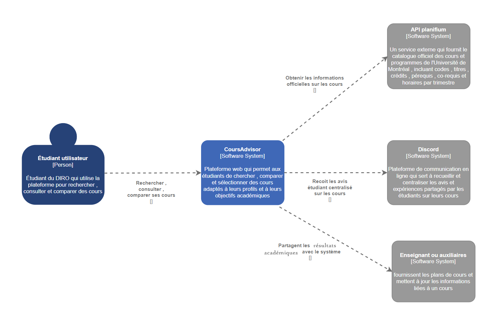
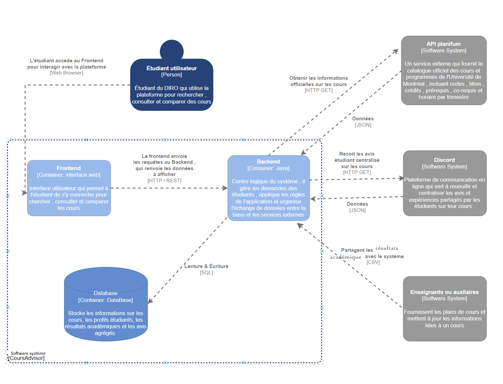
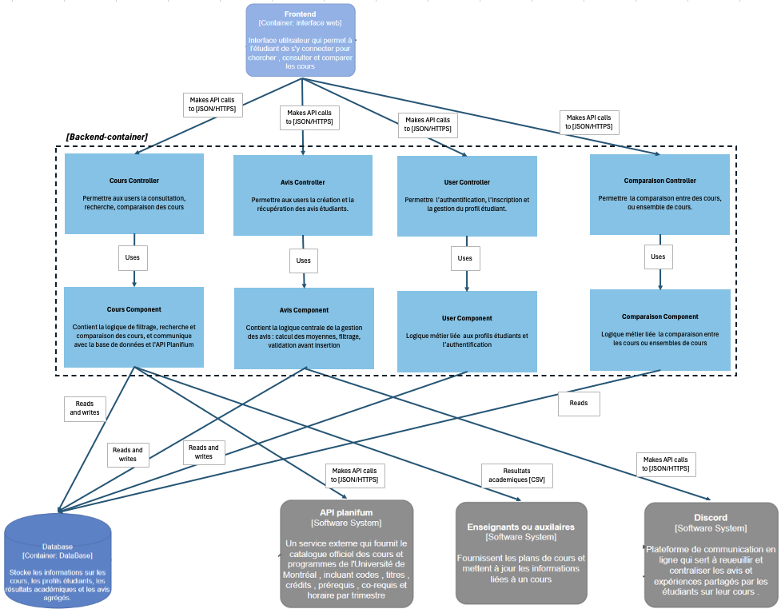
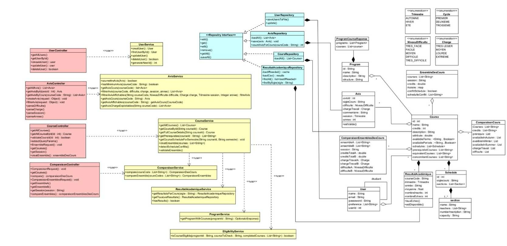
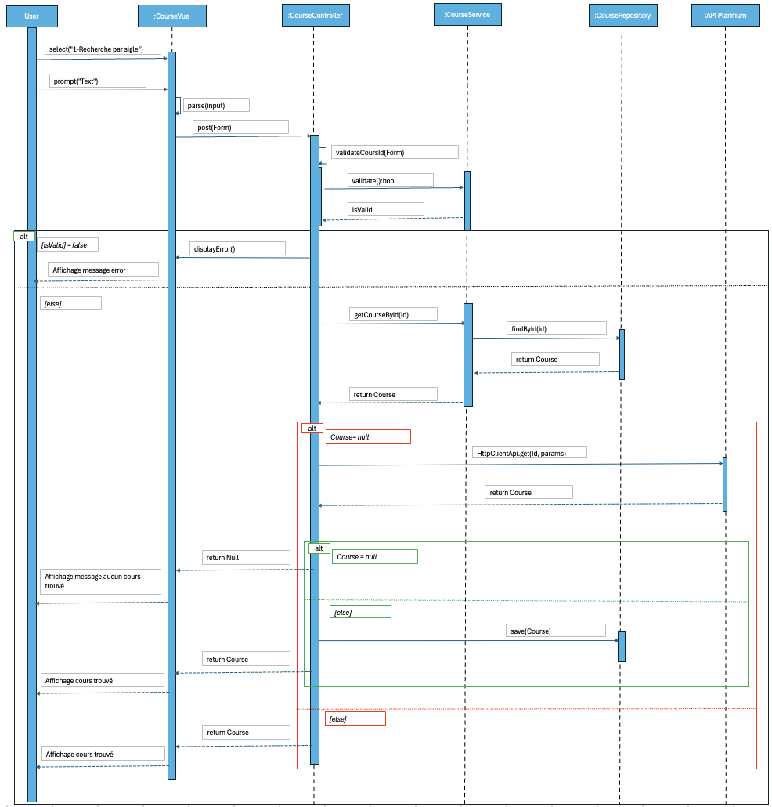
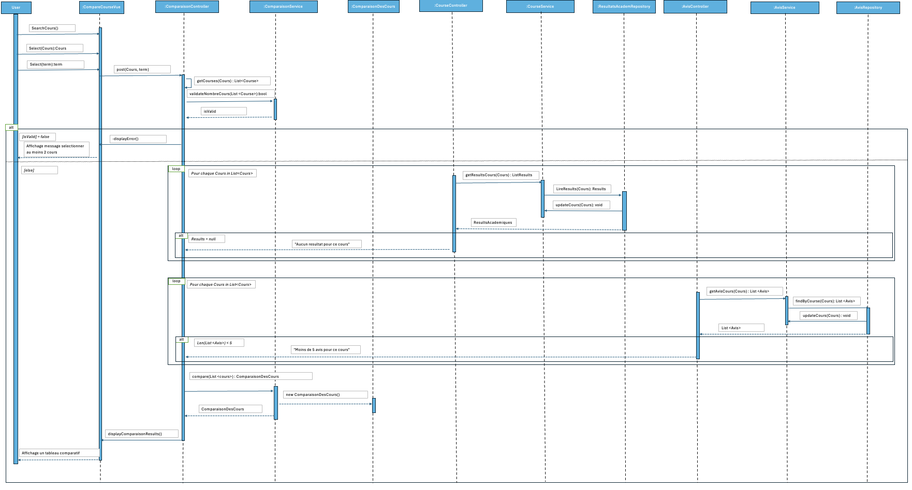
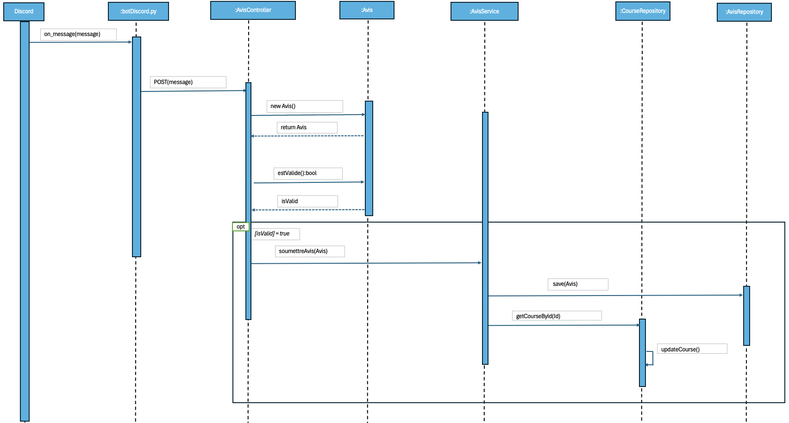

# Architecture du système

## Vue d’ensemble

### Description du type d’architecture retenue :  
Le système CoursAdvisor adopte une architecture en couches orientée services **REST**.
Il s’agit d’un système web distribué composé de trois principaux conteneurs (frontend, backend et base de données) interagissant via des API HTTP REST et des échanges de données au format JSON.
L’application communique également avec des services externes tels que l’API Planifium (pour les informations de cours) et Discord (pour la centralisation des avis étudiants).  
### Raisons du choix :  
  - Permet une séparation claire des responsabilités (présentation, logique métier, données).
  - Facilite l’évolutivité (possibilité de modifier un module sans impacter les autres).
  - Compatible avec les intégrations externes (API Planifium et Discord).  

## Composants principaux  

- Interface (frontend)  
- Backend (Java)  
- Base de données  
- API Planifium (externe)  
- Discord (externe)  
- Profs/ auxiliaires (externe)

## Communication entre composants

- Mécanismes d’échange : appels HTTP, requetes SQL.
- Format des données : JSON, CSV.

## Diagramme d’architecture (Modèle C4)  

L’architecture du backend de CourseAdvisor est organisée en un ensemble cohérent de contrôleurs et de composants spécialisés. Chaque contrôleur sert d’interface entre le frontend et la logique métier interne : il reçoit les requêtes HTTP du frontend, valide les données et délègue le traitement à son composant associé.  
Les composants métier (Cours, Avis, Utilisateurs, Comparaison) encapsulent toute la logique essentielle : filtrage et recherche des cours, gestion des avis, authentification, calcul de comparaisons, etc. Ils communiquent directement avec la base de données interne pour lire ou écrire les informations nécessaires.  
Pour enrichir les données, certains composants interagissent avec des systèmes externes :
-	l’API Planifium pour récupérer les informations officielles des cours ;
-	Discord pour collecter automatiquement les avis étudiants ;
-	les enseignants ou auxiliaires pour fournir les plans de cours et les résultats académiques.   

Le backend agit donc comme un pont entre le frontend web, la base de données interne et plusieurs services externes. Cette architecture modulaire permet de séparer clairement les responsabilités, de faciliter l’évolution du système et d’assurer une communication robuste entre les différentes sources de données.  

### Diagramme d’architecture - Niveau 1

---
### Diagramme d’architecture - Niveau 2

---
### Diagramme d’architecture - Niveau 3

## Diagramme de classes

Notre architecture repose sur une séparation claire des responsabilités selon le modèle **MVC**, telle que présentée dans notre diagramme de classes :

- **Distinction des couches** :
  - **Controllers** : gestion des requêtes et communication avec l’interface ;
  - **Services** : logique métier (`CoursService`, `AvisService`, `ComparaisonService`, etc.) ;
  - **Repositories** : accès, gestion et persistance des données ;
  - **Modèles** : entités du domaine (`Cours`, `Avis`, `User`, `Schedule`, etc.).

- **Forte cohésion** : chaque couche et chaque classe possèdent un rôle unique et précis, ce qui rend le système cohérent et facile à comprendre.

- **Faible couplage** : l’usage de classes abstraites telles que `Service` et `Repository` limite les dépendances directes entre les couches et favorise une meilleure modularité.

- **Centralisation de la logique métier** dans les services, permettant de modifier les règles de filtrage, de comparaison ou de validation sans impacter les contrôleurs ni la couche d’accès aux données.

- **Isolation complète de la persistance** via les repositories, ce qui rend le code plus robuste et facilite un éventuel changement de source de données.

- **Réutilisation élevée du code** à travers des services communs et des modèles partagés.

- **Facilité d’évolution** : l’ajout de nouvelles fonctionnalités (nouveaux filtres, nouveaux types de comparaisons, intégration d’APIs externes comme Planifium ou Discord) peut se faire sans remettre en cause l’architecture existante.

- **Maintenabilité et testabilité renforcées** grâce à cette organisation modulaire et bien découplée.

Cette approche garantit un système **flexible, évolutif et durable**, capable de s’adapter efficacement aux besoins futurs du projet.  

  

## Diagrammes de séquence

### Diagramme de séquence - Recherche de cours

---
### Diagramme de séquence - Comparer des cours

---
### Diagramme de séquence - Soumettre un avis
